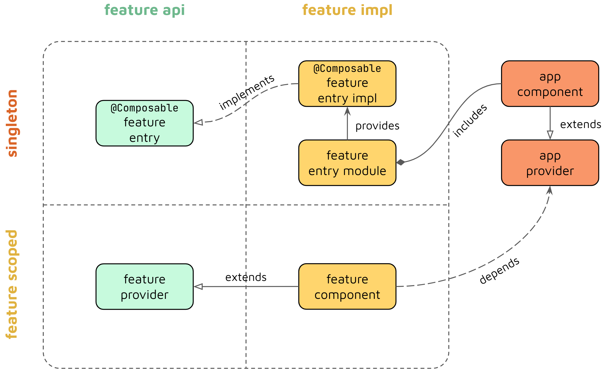

# Skeleton for new compose applications
## Architecture
### Api-Impl separation
[Scalable multi-module architecture for Jetpack Compose apps with Pavlo Stavytsky](https://www.youtube.com/watch?v=j_rEor4YnNc)

## Architecture
The project implements a scalable multi-module architecture that aims to achieve the following goals:
- **Separation of concerns** - strict isolation and separation of logic between features for easier *testability* and *maintainability* of a codebase.
- **Scalability** - the architecture is applicable for projects that use hundreds or thousands Gradle modules.
- **Dependency graph optimization** - allows keeping a developer productivity on a decent level by preventing long build times and ensuring efficient incremental builds.

All the project modules could be separated into **3** types:
- **Feature modules** - which hold a logic related to a specific feature and consist of **API** and **Impl** modules. Former are framework-agnostic and hold lightweight interfaces as feature entry points.
- **Library modules** - commonly used logic by other features.
- **Injector modules** - modules that build a dependency graph of the app. E.g. *app* module.

